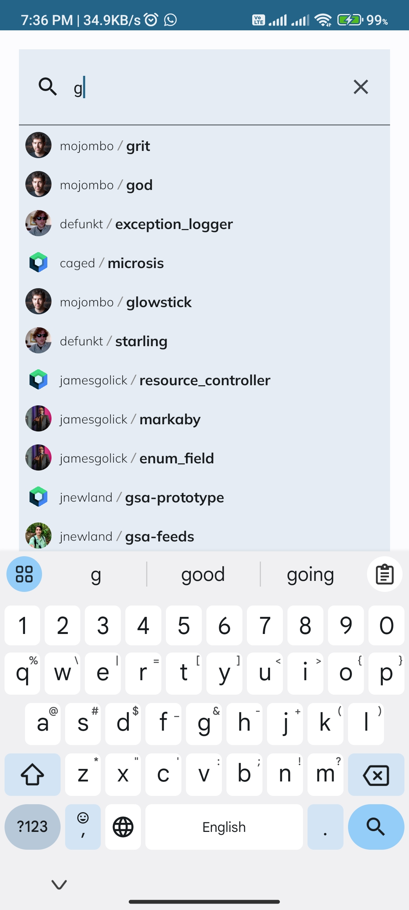

# GitHub Repository Viewer

## Overview

GitHub Repository Viewer is an Android application built using Jetpack Compose that allows users to browse GitHub repositories, view repository details, and explore issues associated with each repository. The application utilizes the GitHub API to fetch the necessary data.

## Features

- **Repository List:** Browse a list of GitHub repositories.
  
    
    
- **Repository Details:** View detailed information about a selected repository.
  
    
    
- **Issues Exploration:** Explore issues associated with a specific repository.
  
    
    
- **Search for Repository:** Explore issues associated with a specific repository.
  
    

## Technologies Used

- **Jetpack Compose:** Modern Android UI toolkit for building native UI.
- **Retrofit:** HTTP client for making API requests.
- **Room:** Persistence library for local data storage.
- **Coroutines:** Asynchronous programming using Kotlin.
- **Flow:** Reactive programming for handling data streams.
- **MVVM Architecture:** Model-View-ViewModel architecture for clean and scalable code.

## Getting Started

To run the application locally, follow these steps:

1. Clone the repository:

    ```bash
    git clone https://github.com/moaazabdelsalam/Repo-Viewer.git
    ```

2. Open the project in Android Studio.

3. Build and run the application on an Android emulator or device.
